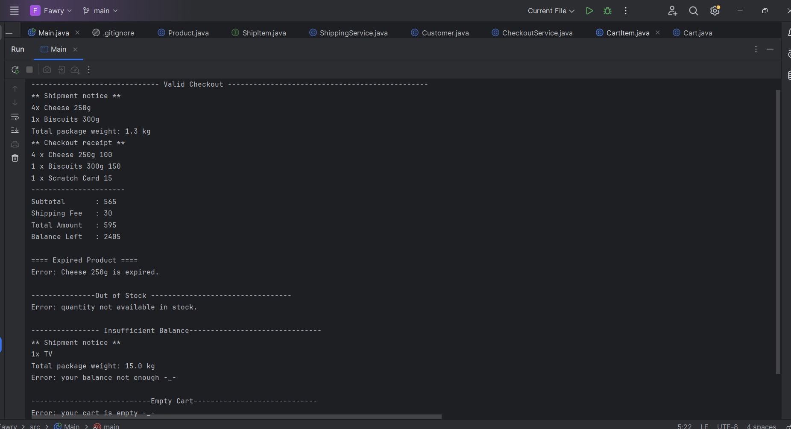

# 🧾  Checkout  App

This is a simple Java console application that simulates an online checkout system, allowing customers to purchase products, handle stock, balance, and shipping.

---

## ✅ Features

- Add different types of products to the cart:
  - Shippable products (e.g., Cheese, TV)
  - Non-shippable products (e.g., Scratch Cards)
- Validate and checkout:
  - Remove expired products
  - Prevent purchasing out-of-stock items
  - Prevent checkout if balance is insufficient
  - Prevent checkout if cart is empty
- Calculate and print:
  - Subtotal
  - Shipping fees
  - Total amount
  - Remaining balance

---

## 🚀 How to Run

1. Open the project in IntelliJ or any Java IDE
2. Run the `Main.java` file
3. Interact through the console

Make sure you are using Java 8+.

---

## 📸 Screenshot

> Below is a screenshot from the running app:

---

## 🔧 Technologies Used

- Java (OOP principles)
- IntelliJ IDEA
- Git & GitHub

---

## 🧑‍💻 Author

Esraa Mahmoud  
[GitHub Profile](https://github.com/esraamahmoudd)
